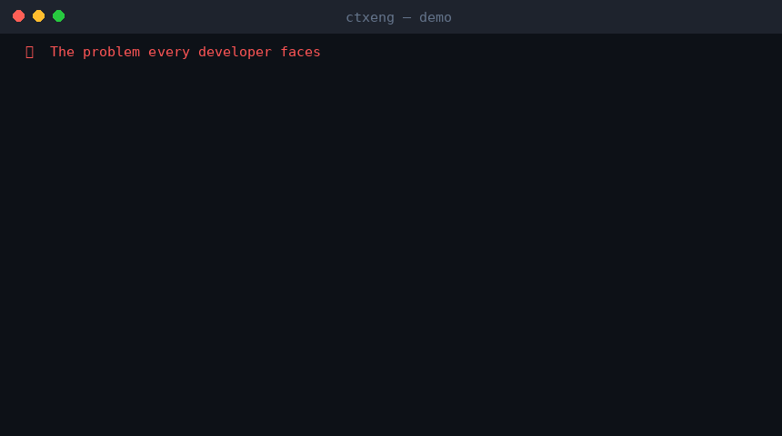

# ctxeng — Python Context Engineering Library

<p align="center">
  <strong>Stop copy-pasting files into ChatGPT.<br>
  Build the perfect LLM context from your codebase, automatically.</strong>
</p>

<p align="center">
  <a href="https://pypi.org/project/ctxeng/"></a>
  <a href="https://github.com/sayeem3051/python-context-engineer/actions"></a>
  <a href="https://codecov.io/gh/Sayeem3051/python-context-engineer"></a>
  <a href="https://pypi.org/project/ctxeng/"></a>
  
  <a href="https://pepy.tech/project/ctxeng"></a>
</p>

<p align="center">
  
</p>

---

**Context engineering** is the new prompt engineering.
The quality of your LLM's output depends almost entirely on *what you put in the context window* — not how you phrase the question.

`ctxeng` solves this automatically:

- **Scans your codebase** and scores every file for relevance to your query
- **Ranks by signal** — keyword overlap, AST symbols, git recency, import graph
- **Fits the budget** — smart truncation keeps the best parts within any model's token limit
- **Ships ready to paste** — XML, Markdown, or plain text output that works with Claude, GPT-4o, Gemini, and every other model

Docs:
- [`docs/ARCHITECTURE.md`](docs/ARCHITECTURE.md)
- [`docs/PERFORMANCE.md`](docs/PERFORMANCE.md)
- [`docs/FAQ.md`](docs/FAQ.md)

One small dependency ([pathspec](https://pypi.org/project/pathspec/)) powers ``.ctxengignore`` (gitignore-style patterns). Works with any LLM.

---

## Installation

```bash
# Core install (includes .ctxengignore support)
pip install ctxeng
# pathspec is included automatically
```

For accurate token counting (strongly recommended):

```bash
pip install "ctxeng[tiktoken]"
```

For file watching (used by `ctxeng watch` when that command is available):

```bash
pip install "ctxeng[watch]"
```

For semantic similarity scoring (optional local embeddings):

```bash
pip install "ctxeng[semantic]"
```

Default semantic model is `all-mpnet-base-v2`. Override with `--semantic-model` when building context.

For one-line LLM calls:

```bash
pip install "ctxeng[anthropic]"    # Claude
pip install "ctxeng[openai]"       # GPT-4o
pip install "ctxeng[all]"          # everything
```

---

## Quickstart

### Python API

```python
from ctxeng import ContextEngine

engine = ContextEngine(root=".", model="claude-sonnet-4")
ctx = engine.build("Fix the authentication bug in the login flow")

print(ctx.summary())
# Context summary (12,340 tokens / 197,440 budget):
#   Included : 8 files
#   Skipped  : 23 files (over budget)
#   Est. cost: ~$0.037 (claude-sonnet-4)
#   [████████  ] 0.84  src/auth/login.py
#   [███████   ] 0.71  src/auth/middleware.py
#   [█████     ] 0.53  src/models/user.py
#   [████      ] 0.41  tests/test_auth.py
#   ...

# Paste directly into your LLM
print(ctx.to_string())
```

### Fluent Builder API

```python
from ctxeng import ContextBuilder

ctx = (
    ContextBuilder(root=".")
    .for_model("gpt-4o")
    .only("**/*.py")
    .exclude("tests/**", "migrations/**")
    .from_git_diff()                        # only changed files
    .with_system("You are a senior Python engineer. Be concise.")
    .build("Refactor the payment module to use async/await")
)

print(ctx.to_string("markdown"))
```

### One-line LLM call

```python
from ctxeng import ContextEngine
from ctxeng.integrations import ask_claude

engine = ContextEngine(".", model="claude-sonnet-4")
ctx = engine.build("Why is the test_login test failing?")

response = ask_claude(ctx)
print(response)
```

### CLI

```bash
# Build context for a query and print to stdout
ctxeng build "Fix the auth bug"

# Focused on git-changed files only
ctxeng build "Review my changes" --git-diff

# Target a specific model with markdown output
ctxeng build "Refactor this" --model gpt-4o --fmt markdown

# Save to file
ctxeng build "Explain the payment flow" --output context.md

# Project stats
ctxeng info
```

### Watch mode

Automatically rebuild context when files change (requires `watchdog`):

```bash
pip install "ctxeng[watch]"
ctxeng watch "Fix the auth bug" --output context.md
```

Example output:

```text
[14:32:01] File changed: src/auth/login.py
[14:32:01] Rebuilding context...
[14:32:01] Done. 8 files, 12,340 tokens, ~$0.037
[14:32:01] Written to: context.md
```

### `.ctxengignore`

Add a **`.ctxengignore`** file at your project root to exclude paths from filesystem discovery (same syntax as **`.gitignore`**). It is applied automatically when you run `ctxeng build`, `ctxeng info`, or `ContextEngine` / `ContextBuilder` without explicit `--files` / `include_files`.

Example `.ctxengignore`:

```gitignore
# Dependencies
node_modules/
venv/
.venv/

# Build artifacts
dist/
build/
*.egg-info/

# Migrations
migrations/**
**/migrations/**

# Lock files
*.lock
poetry.lock
package-lock.json
```

Supported patterns include `*`, `?`, `**`, directory slashes, and negation with `!` (full gitwildmatch semantics via pathspec). If `.ctxengignore` is missing, nothing is excluded beyond ctxeng’s built-in skips.

```python
from pathlib import Path
from ctxeng import parse_ctxengignore

patterns = parse_ctxengignore(Path("."))
# → list of pattern strings, or [] if no file
```

### Secrets & PII Redaction

ctxeng automatically redacts common secrets and PII from file contents before sending to any LLM:

- API keys and tokens
- Passwords and credentials
- Email addresses
- Private keys

Redaction happens before token counting, tracing, and output — your secrets never leave your machine.

To disable:

```bash
ctxeng build "Your query" --no-redact
```

### RAG (Intelligent Chunk Retrieval)

For large repositories, `--rag` switches from whole-file inclusion to **chunk-level retrieval**. ctxeng splits top-ranked files into overlapping chunks, then selects the most relevant chunks for your query:

- Uses **embeddings** when `sentence-transformers` is installed
- Falls back to **lexical retrieval** when embeddings aren’t available
- Chunks Python files by **function/class** boundaries when possible

```bash
ctxeng build "Explain the login flow" --rag
```

### AST Skeleton (Python)

`--skeleton` replaces Python file bodies with an AST-derived outline (imports, classes, methods, function signatures). This is useful when you want a high-level overview within a tight token budget:

```bash
ctxeng build "Give me a high-level architecture overview" --skeleton
```

### Few-shot Examples

You can inject a small “style guide” / best-practice library into the context with `--fewshot`. Put markdown/text files under `.ctxeng/examples/` and enable:

```bash
ctxeng build "Refactor this module" --fewshot
```

### CI subcommand

Use `ctxeng ci` for pipeline-friendly context generation. It always writes to a file and is designed for non-interactive runs:

```bash
ctxeng ci "Generate release notes" --output context.md --fmt markdown --trace
```

### Import graph (Python)

After files are scored, **ctxeng** parses static ``import`` / ``from … import`` statements in each discovered ``.py`` file, resolves **relative imports** from the file’s location, and can **pull in imported modules** from the same collection set before the token budget is applied.

- **Default:** one hop (`import_graph_depth=1`), relevance for added files = parent score × **0.7**
- **Edges only** to files already in the current discovery set (filesystem / git / explicit list)
- Stdlib and third-party imports are ignored (no file under your root → no edge)

```python
from ctxeng import ContextEngine, ContextBuilder

# Engine: on by default; adjust depth or turn off
engine = ContextEngine(
    root=".",
    use_import_graph=True,
    import_graph_depth=2,
)

ctx = (
    ContextBuilder(".")
    .for_model("claude-sonnet-4")
    .use_import_graph(depth=2)   # follow two hops of local imports
    # .no_import_graph()         # disable expansion
    .build("Fix the checkout bug in orders")
)
```

CLI (import expansion is **on** by default):

```bash
ctxeng build "Refactor auth" --no-import-graph
ctxeng build "Refactor auth" --import-graph-depth 2
```

Lower-level API:

```python
from pathlib import Path
from ctxeng import build_import_graph, expand_with_imports
from ctxeng.models import ContextFile

paths = [Path("src/app.py"), Path("src/lib.py")]
graph = build_import_graph(Path("."), paths)
# graph[path] → list of imported paths (within `paths`)

expanded = expand_with_imports(
    [ContextFile(path=paths[0], content="...", relevance_score=0.9, language="python")],
    graph,
    Path("."),
    max_depth=1,
    score_decay=0.7,
)
```

### Cost estimates

`ContextEngine` fills ``ctx.cost_estimate`` with a **rough USD** figure for **input tokens** only, using built-in per‑1K rates for common models (see ``ctxeng.costs.COST_PER_1K_INPUT_TOKENS``). Unknown model names yield ``None``. Rates are indicative—verify with your provider before budgeting.

``Context.summary()`` includes a line when a cost is known:

```text
Context summary (12,340 tokens / 197,440 budget):
  Included : 8 files
  Skipped  : 23 files (over budget)
  Est. cost: ~$0.037 (claude-sonnet-4)
```

```python
from ctxeng import estimate_cost, ContextEngine

engine = ContextEngine(root=".", model="gpt-4o")
ctx = engine.build("Explain this module")
print(ctx.cost_estimate)   # float | None
print(ctx.summary())       # includes Est. cost when known
```

CLI: cost line is **on** by default; use ``--no-show-cost`` to omit it from stderr.

---

## How It Works

<p align="center">
  
</p>

### Scoring signals

Each file gets a relevance score from 0 → 1, combining:

| Signal | What it measures |
|--------|-----------------|
| **Keyword overlap** | How many query terms appear in the file content |
| **AST symbols** | Class/function/import names that match the query (Python) |
| **Path relevance** | Filename and directory names matching query tokens |
| **Git recency** | Files touched in recent commits score higher |
| **Import expansion** | After scoring, locally imported Python modules can be added with a decayed score |
| **Semantic similarity** | Optional embedding similarity between query and file content |

### Token budget optimization

Files are ranked by score and filled greedily into the token budget. Files that don't fit are **smart-truncated** (head + tail, never middle) rather than dropped entirely — the top of a file has imports and class defs; the tail has recent changes. Both are high-signal.

---

## Examples

### Debug a failing test

```python
from ctxeng import ContextBuilder
from ctxeng.integrations import ask_claude

ctx = (
    ContextBuilder(".")
    .for_model("claude-sonnet-4")
    .include_files("tests/test_payment.py", "src/payment/service.py")
    .with_system("You are a Python debugging expert.")
    .build("test_charge_user is failing with a KeyError on 'amount'")
)
response = ask_claude(ctx)
```

### Code review on a PR

```python
# Only include what changed in this branch vs main
ctx = (
    ContextBuilder(".")
    .for_model("gpt-4o")
    .from_git_diff(base="main")
    .with_system("Do a thorough code review. Flag security issues first.")
    .build("Review this pull request")
)
```

### Explain an unfamiliar codebase

```python
from ctxeng import ContextEngine

engine = ContextEngine(
    root="/path/to/project",
    model="gemini-1.5-pro",  # 1M token window → include everything
)
ctx = engine.build("Give me a high-level architecture overview")
print(ctx.to_string())
```

### Targeted refactor

```python
ctx = (
    ContextBuilder(".")
    .for_model("claude-sonnet-4")
    .only("src/database/**/*.py")
    .exclude("**/*_test.py")
    .build("Convert all raw SQL queries to use SQLAlchemy ORM")
)
```

---

## API Reference

### `ContextEngine`

```python
ContextEngine(
    root=".",               # Project root
    model="claude-sonnet-4",# Sets token budget automatically
    budget=None,            # Or explicit TokenBudget(total=50_000)
    max_file_size_kb=500,   # Skip files larger than this
    include_patterns=None,  # ["**/*.py"] — only these files
    exclude_patterns=None,  # ["tests/**"] — skip these
    use_git=True,           # Use git recency signal
    use_import_graph=True,  # Add local Python imports of scored files
    import_graph_depth=1,    # Hops along the import graph
)
```

```python
engine.build(
    query="",               # What you want the LLM to do
    files=None,             # Explicit list of paths (skips auto-discovery)
    git_diff=False,         # Only changed files
    git_base="HEAD",        # Diff base ref
    system_prompt="",       # System prompt (counts against budget)
    fmt="xml",              # "xml" | "markdown" | "plain"
)
# → Context
```

### `ContextBuilder` (fluent API)

```python
ContextBuilder(root=".")
    .for_model("gpt-4o")
    .with_budget(total=50_000, reserved_output=4096)
    .only("**/*.py", "**/*.yaml")
    .exclude("tests/**", "migrations/**")
    .include_files("src/specific.py")
    .from_git_diff(base="main")
    .with_system("You are an expert Python engineer.")
    .max_file_size(200)     # KB
    .no_git()
    .use_import_graph(depth=2)  # optional; omit for default depth 1
    .build("query")
# → Context
```

### `Context`

```python
ctx.to_string(fmt="xml")    # → str ready to paste into an LLM
ctx.summary(show_cost=True) # → summary; optional show_cost=False hides Est. cost
ctx.cost_estimate           # → float | None (rough input USD for known models)
ctx.files                   # → list[ContextFile], sorted by relevance
ctx.skipped_files           # → files that didn't fit the budget
ctx.total_tokens            # → estimated token usage
ctx.budget.available        # → remaining token budget
```

### `TokenBudget`

```python
TokenBudget.for_model("claude-sonnet-4")  # auto-detect limit
TokenBudget(total=50_000, reserved_output=2048, reserved_system=512)
```

Supported models (auto-detected): `claude-opus-4`, `claude-sonnet-4`, `claude-haiku-4`, `gpt-4o`, `gpt-4-turbo`, `gpt-4`, `gpt-3.5-turbo`, `gemini-1.5-pro`, `gemini-1.5-flash`, `llama-3`.

---

## CLI Reference

```
ctxeng [--root PATH] <command> [options]

Commands:
  build   Build context for a query
  info    Show project info and file stats

build options:
  --model, -m     Target model (default: claude-sonnet-4)
  --fmt, -f       Output format: xml | markdown | plain (default: xml)
  --output, -o    Write to file instead of stdout
  --only          Glob patterns to include
  --exclude       Glob patterns to exclude
  --files         Explicit file list
  --git-diff      Only include git-changed files
  --git-base      Git base ref (default: HEAD)
  --system        System prompt text
  --budget        Override total token budget
  --no-git        Disable git recency scoring
  --max-size      Max file size in KB (default: 500)
  --import-graph / --no-import-graph
                  Expand with local Python import graph (default: on)
  --import-graph-depth N
                  Import hops when import graph is on (default: 1)
  --show-cost / --no-show-cost
                  Include estimated input cost in stderr summary (default: on)
  --semantic       Enable semantic similarity scoring (requires sentence-transformers)
  --semantic-model Semantic model name (default: all-mpnet-base-v2)
  --gitignore / --no-gitignore
                  Respect .gitignore in addition to .ctxengignore (default: on)
  --allow          Allowlist path prefixes; only these paths may be included
  --deny           Denylist path prefixes; these paths will never be included
  --trace          Write a JSONL trace under .ctxeng/traces/
  --trace-dir      Override trace output directory
  --trace-id       Provide a custom trace id
  --rag            Enable chunk-level retrieval (RAG)
  --rag-max-chunks Max chunks to retrieve (default: 20)
  --rag-chunk-max-lines
                  Chunk size in lines (default: 120)
  --rag-chunk-overlap
                  Chunk overlap in lines (default: 20)
  --rag-embedding-model
                  Sentence-transformers model name for embeddings
  --skeleton       Use AST skeletons for Python files
  --fewshot        Inject few-shot examples from .ctxeng/examples
  --fewshot-dir    Few-shot examples directory (default: .ctxeng/examples)
  --fewshot-max-files
                  Max few-shot files (default: 5)
  --snapshot       Save a versioned context snapshot under .ctxeng/snapshots/
  --snapshot-id    Optional snapshot id

watch options:
  --interval S    Polling interval in seconds (default: 1.0)
  --semantic       Enable semantic similarity scoring (requires sentence-transformers)
  --semantic-model Semantic model name (default: all-mpnet-base-v2)
  --gitignore / --no-gitignore
                  Respect .gitignore in addition to .ctxengignore (default: on)
  --allow          Allowlist path prefixes; only these paths may be included
  --deny           Denylist path prefixes; these paths will never be included
  --trace          Write a JSONL trace under .ctxeng/traces/
  --trace-dir      Override trace output directory
  --trace-id       Provide a custom trace id
  --rag            Enable chunk-level retrieval (RAG)
  --rag-max-chunks Max chunks to retrieve (default: 20)
  --rag-chunk-max-lines
                  Chunk size in lines (default: 120)
  --rag-chunk-overlap
                  Chunk overlap in lines (default: 20)
  --rag-embedding-model
                  Sentence-transformers model name for embeddings
  --skeleton       Use AST skeletons for Python files
  --fewshot        Inject few-shot examples from .ctxeng/examples
  --fewshot-dir    Few-shot examples directory (default: .ctxeng/examples)
  --fewshot-max-files
                  Max few-shot files (default: 5)
```

---

## Security (redaction)

By default, ctxeng **redacts common secrets and PII** from file contents before they are counted for tokens, traced, or printed.

## Tracing

Enable local tracing with:

```bash
ctxeng build "Fix auth" --trace
```

This writes JSONL events to `<root>/.ctxeng/traces/` and also includes `trace_id` and `trace_path` in the context metadata.

## Snapshots

Save a reproducible output bundle:

```bash
ctxeng build "Review changes" --git-diff --snapshot --output context.xml
```

Snapshots are saved under `<root>/.ctxeng/snapshots/<id>/` with `context.txt` and `manifest.json`.

## CI

Use `ctxeng ci` in pipelines:

```bash
ctxeng ci "Generate docs" --output artifact_context.md --fmt markdown --trace --snapshot
```

## Supported Models

| Model | Context window | Auto-detected |
|-------|---------------|---------------|
| claude-opus-4, claude-sonnet-4, claude-haiku-4 | 200K | ✓ |
| gpt-4o, gpt-4-turbo | 128K | ✓ |
| gpt-4 | 8K | ✓ |
| gpt-3.5-turbo | 16K | ✓ |
| gemini-1.5-pro, gemini-1.5-flash | 1M | ✓ |
| llama-3 | 32K | ✓ |
| any other | 32K (safe default) | — |

---

## Why not just paste files manually?

You could. But you'll hit these problems immediately:

- **Token limit errors** — too many files, context overflows
- **Irrelevant noise** — wrong files dilute signal, hurt output quality
- **Stale context** — you forget to update when code changes
- **Manual effort** — figuring out which files matter takes time

`ctxeng` solves all four. The right files, in the right order, trimmed to fit, every time.

---

## Roadmap

- [x] Semantic similarity scoring ✅
- [x] `ctxeng watch` — auto-rebuild on file changes ✅
- [x] VSCode extension ✅
- [x] Streaming context into LLM APIs ✅
- [x] Cost estimates (input-token USD hint in summary) ✅
- [x] Import graph analysis (local Python static imports) ✅
- [x] `.ctxengignore` file support ✅
- [x] `.gitignore` support (respected by default) ✅
- [x] Secrets/PII redaction before output ✅
- [x] Local JSONL tracing (what was included and why) ✅
- [x] Chunk-level RAG (lexical fallback, embeddings optional) ✅
- [x] Python AST skeleton mode ✅
- [x] Context snapshots + CI subcommand ✅
- [x] Few-shot examples injection ✅

---

## Contributing

PRs welcome! See [CONTRIBUTING.md](CONTRIBUTING.md).

## Test coverage

We track coverage with `pytest-cov` in CI and upload `coverage.xml` to Codecov.

- **Goal**: keep coverage **above 80%**
- **Local run**:

```bash
pip install -e ".[dev]"
pytest --cov=ctxeng --cov-report=term-missing --cov-report=xml
```

```bash
git clone https://github.com/sayeem3051/python-context-engineer
cd python-context-engineer
pip install -e ".[dev]"
pytest
```

---

## License

MIT. Use freely, modify as needed, contribute back if you can.

---

<p align="center">
  If <code>ctxeng</code> saved you time, please ⭐ the repo — it helps others find it.
</p>
