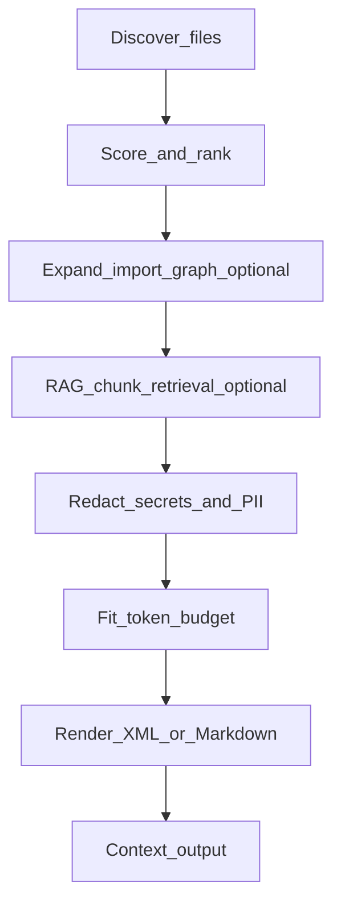

## Architecture

`ctxeng` builds LLM-ready context from your repository by running a simple pipeline:

### Inputs
- **Repository root** (`--root`)
- **Task/query** (free text)
- **Options**: import graph, semantic scoring, RAG, skeleton mode, redaction, tracing

### Scoring signals
Each file gets a relevance score in \([0,1]\) from a weighted mix of:
- **Keyword overlap** with the query
- **Path relevance** (filename + directories)
- **AST symbol overlap** (Python built-in; JS/TS/Go via optional tree-sitter)
- **Git recency** (recently changed files score higher)
- **Semantic similarity** (optional, sentence-transformers)

### Budgeting
After ranking, files/chunks are added in descending score order until the token budget is reached.\nWhen a file is too large, ctxeng applies smart truncation (head + tail) before skipping.

### Safety
Before any output or trace is written, ctxeng can **redact secrets/PII**. This happens **before token counting, tracing, and rendering**.

